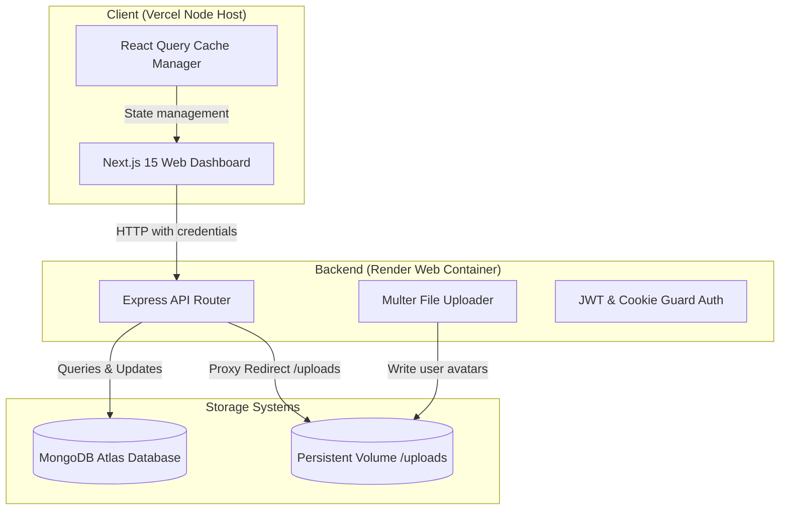

# 🎓 TutorConnect

An elegant, modern online tutoring platform designed to connect students with skilled educators, schedule learning sessions, process mock transactions, and monitor study milestones in real-time.

<div align="center">

[](https://tutor-connect-ds8i.vercel.app/)
[](https://tutorconnect-uzxw.onrender.com/)

<br/>

[](https://nextjs.org/)
[](https://react.dev/)
[](https://www.typescriptlang.org/)
[](https://tailwindcss.com/)
[](https://nodejs.org/)
[](https://expressjs.com/)
[](https://www.mongodb.com/)

</div>

---

## 🚀 Key Features

### 👨‍🎓 For Students
* **Discover Tutors**: Search and filter qualified tutors by subjects, hourly rate, and user reviews.
* **Instant Booking**: Interactive timezone-agnostic booking calendar supporting variable session durations.
* **Mock Checkout & Payments**: Integrated billing history and transaction invoice receipt logging.
* **Milestone Progress Tracking**: Dynamic visual metrics showing learning objectives, topics covered, and timeline updates from tutors.
* **Profile Customization**: Customize name, grade level, core learning goals, and upload profile pictures.

### 👩‍🏫 For Tutors
* **Class Schedule Manager**: View, filter, and track upcoming sessions and client info.
* **Progress Logging**: Submit timeline updates, set subject milestones, and write comments for students.
* **Revenue Statistics**: Interactive earnings dashboard reporting withdrawal history and monthly stats.
* **Active Hours Controller**: Custom schedule settings page featuring a **1-click Quick Seed tool** to pre-fill standard Mon-Sun availability.
* **Profile Editing**: Set hourly rates, years of experience, taught subjects, public bio, and change profile photos.

---

## 🛠️ Technology Stack

| Layer | Technologies |
| :--- | :--- |
| **Frontend** | Next.js 15, React 19, TypeScript, Tailwind CSS, TanStack React Query, Lucide Icons |
| **Backend** | Node.js, Express, Multer (file uploads), JWT authentication, Cookie-Parser |
| **Database** | MongoDB Atlas, Mongoose ODM |
| **Deployment** | Vercel (Frontend), Render (Backend + Persistent Disk Storage) |

---

## 📊 System Architecture



---

## 🔧 Local Development Setup

### Prerequisites
* [Node.js](https://nodejs.org/) (v18.x or higher)
* [MongoDB](https://www.mongodb.com/try/download/community) (Local installation or MongoDB Atlas cluster link)

### 1. Repository Installation
Clone the repository:
```bash
git clone https://github.com/KUMAR-AKASH-M/TutorConnect.git
cd TutorConnect
```

### 2. Configure Backend
Go to the backend directory, install packages, and set up your environment credentials:
```bash
cd backend
npm install
```
Create a `.env` file in the `backend/` directory:
```env
PORT=5000
MONGO_URI=mongodb://127.0.0.1:27017/tutorconnect
JWT_SECRET=your_jwt_secret_key_here
JWT_EXPIRES_IN=7d
COOKIE_EXPIRES_DAYS=7
CLIENT_URL=http://localhost:3000
```
Start the backend development server:
```bash
npm run dev
```

### 3. Configure Frontend
Open a new terminal tab, navigate to the frontend directory, install packages, and launch:
```bash
cd ../frontend
npm install
npm run dev
```
Open [http://localhost:3000](http://localhost:3000) in your browser.

---

## 🌐 Production Deployment Configuration

### 1. Render Dashboard (Backend Service)
Deploy your backend directory as a **Web Service**:
* **Root Directory**: `backend`
* **Build Command**: `npm install`
* **Start Command**: `node src/app.js`
* **Disk Mount**: Add a 1GB persistent storage disk mounted at `/opt/render/project/src/backend/src/uploads` to preserve profile pictures.

Configure the environment variables in Render:
```env
NODE_ENV=production
MONGO_URI=mongodb+srv://<username>:<password>@<cluster>.mongodb.net/TutorConnect
JWT_SECRET=your_production_secret
CLIENT_URL=https://your-frontend-project.vercel.app
```

### 2. Vercel Dashboard (Frontend Service)
Deploy your frontend directory to **Vercel**:
* **Framework Preset**: `Next.js`
* **Root Directory**: `frontend`
* Set Next.js to ignore strict typescript/eslint checks in [next.config.ts](frontend/next.config.ts) for production builds.

---

## 👥 Core Contributors

1. **Aditya Kumar**
   * GitHub: [adityak71](https://github.com/adityak71)
   * LinkedIn: [aditya-kumar-lpu](https://www.linkedin.com/in/aditya-kumar-lpu)

2. **Kumar Akash**
   * GitHub: [KUMAR-AKASH-M](https://github.com/KUMAR-AKASH-M)
   * LinkedIn: [kumar-akash01](https://www.linkedin.com/in/kumar-akash01)

3. **Gourob Karmakar**
   * GitHub: [Gourob-karmakar](https://github.com/Gourob-karmakar)
   * LinkedIn: [gourobkarmakar](https://www.linkedin.com/in/gourobkarmakar)
